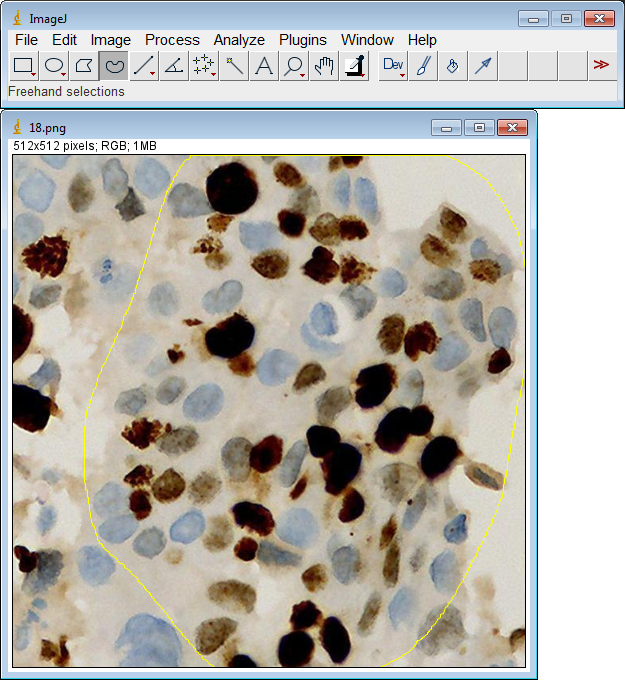
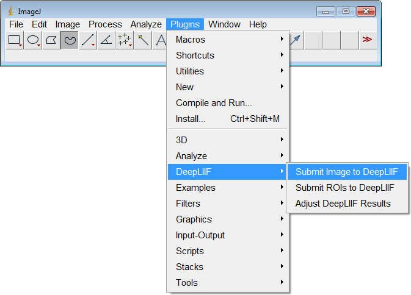

# DeepLIIF ImageJ Plugin

This is a plugin for ImageJ which allows users to easily submit images to [DeepLIIF](https://deepliif.org) for IHC quantification.

## Installing the DeepLIIF Plugin

1. Download `DeepLIIF_ImageJ.jar` from [Zenodo](https://zenodo.org/record/4751737) (or build it using the instructions below).
2. Open ImageJ and navigate to the `Plugins > Install...` menu item.
3. Select the `DeepLIIF_ImageJ.jar` file.
4. Install it into the `ImageJ/plugins` directory.

## Using the DeepLIIF Plugin

1. Open an image file in ImageJ.

2. If desired, select a region of interest to process.  Otherwise, the entire image will be processed.  (Note: DeepLIIF currently has a limit on image dimensions of 3000 x 3000 pixels.)

3. Navigate to the `Plugins > DeepLIIF > Submit Image to DeepLIIF` menu item.

4. Choose the resolution/magnification of your image (`10x`, `20x`, or `40x`) and click `OK`.

5. The image will be sent to the DeepLIIF server for processing.  This can take several seconds or more, depending on the image size.

6. The resulting inferred images and IHC scoring will be stored in a folder in the same directory as the original image.  This folder is numbered, so that multiple runs on the same image (or regions of the image) will not overwrite previous results.  The classification overlay image and IHC scores are displayed.

7. If desired, interactive adjustment can be performed on this result before the image or score windows are closed.  Navigate to the `Plugins > DeepLIIF > Adjust DeepLIIF Results` menu item.

8. Adjust the two sliders to change to segmentation threshold and size gating as desired.  As the sliders are adjusted, the image will update to preview the results.  The segmentation threshold adjusts how the generated probability map is used to classify the pixels as positive or negative.  Size gating allows smaller cells to be omitted from the final results.

9. When satisfied with the settings, click `OK` to send the images to the DeepLIIF server for processing.  This can take several seconds or more, depending on the image size.

10. The updated classification images and IHC scoring are written to their corresponding files.  The updated classification overlay image and IHC scores are displayed.

11. Further adjustments can be made if desired, repeating steps 7-10, until the result image and score windows are closed.

## Building the DeepLIIF Plugin

1. Make sure that you have [Maven](https://maven.apache.org) installed.
2. From this `ImageJ_Plugin` directory, run `mvn package`.
3. Upon successful compilation, the file `DeepLIIF_ImageJ.jar` will be created.