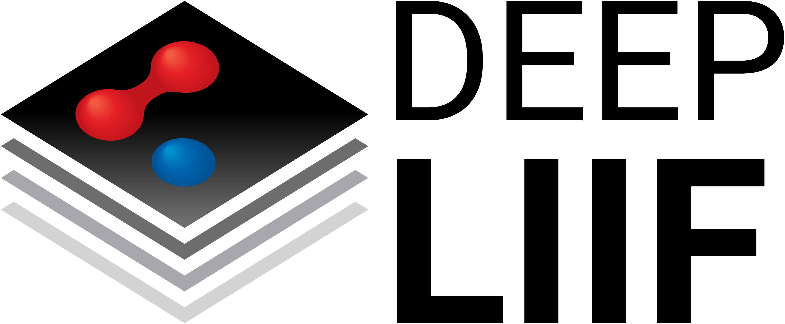
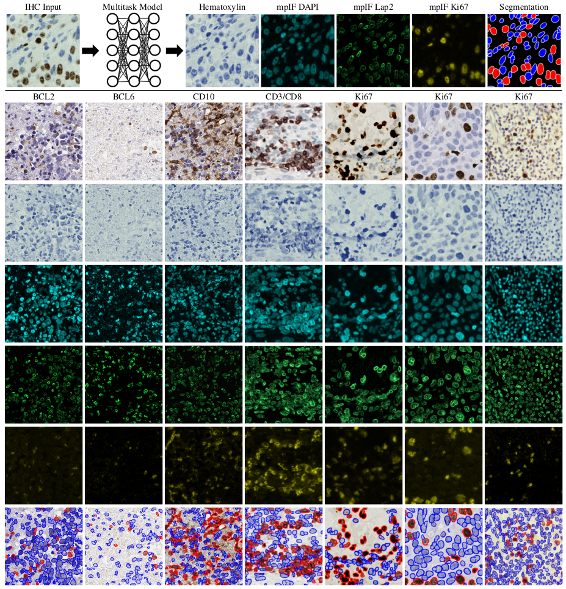
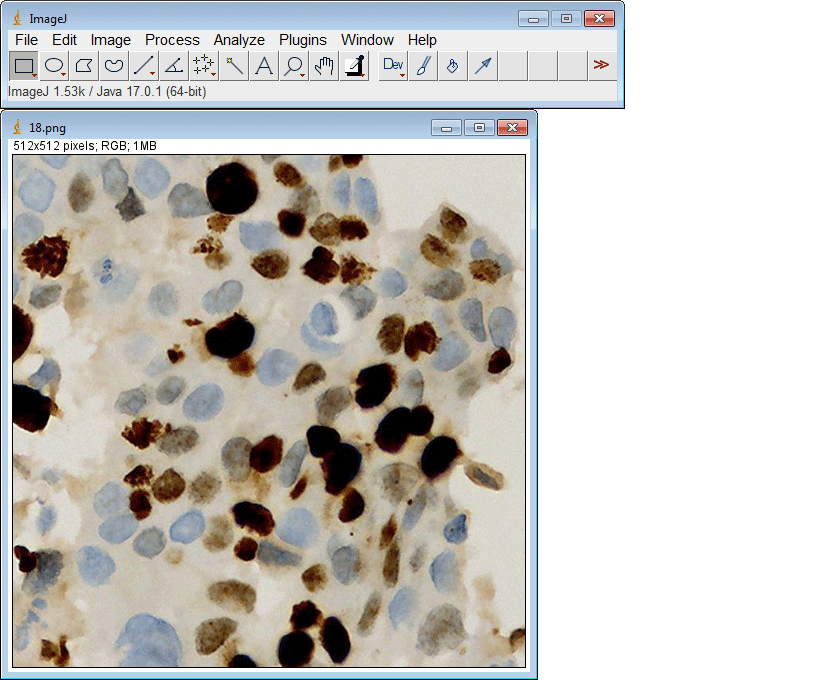
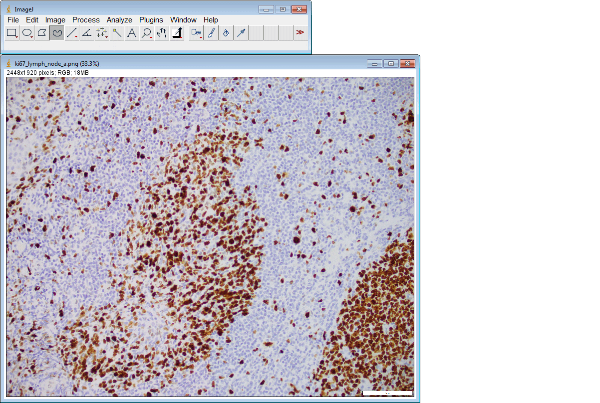
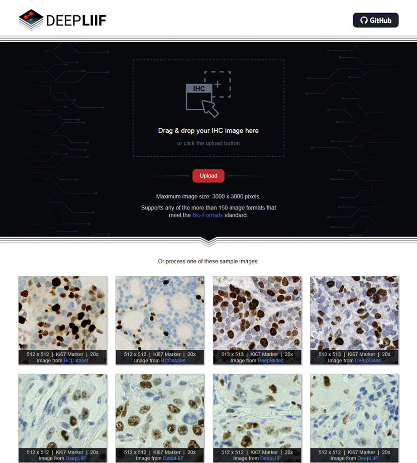

<!-- PROJECT LOGO -->
<br />
<p align="center">
    
    <h3 align="center"><strong>Deep-Learning Inferred Multiplex Immunofluorescence for Immunohistochemical Image Quantification</strong></h3>
    <p align="center">
    <a href="https://rdcu.be/cKSBz">Nature MI'22</a>
    |
    <a href="https://openaccess.thecvf.com/content/CVPR2022/html/Ghahremani_DeepLIIF_An_Online_Platform_for_Quantification_of_Clinical_Pathology_Slides_CVPR_2022_paper.html">CVPR'22</a>
    |
    <a href="https://arxiv.org/abs/2305.16465">MICCAI'23</a>
    |
    <a href="https://onlinelibrary.wiley.com/share/author/4AEBAGEHSZE9GDP3H8MN?target=10.1111/his.15048">Histopathology'23</a>
    |
    <a href="https://deepliif.org/">Cloud Deployment</a>
    |
    <a href="https://nadeemlab.github.io/DeepLIIF/">Documentation</a>
    |
    <a href="#support">Support</a>
  </p>
</p>

*Reporting biomarkers assessed by routine immunohistochemical (IHC) staining of tissue is broadly used in diagnostic 
pathology laboratories for patient care. To date, clinical reporting is predominantly qualitative or semi-quantitative. 
By creating a multitask deep learning framework referred to as DeepLIIF, we present a single-step solution to stain 
deconvolution/separation, cell segmentation, and quantitative single-cell IHC scoring. Leveraging a unique de novo 
dataset of co-registered IHC and multiplex immunofluorescence (mpIF) staining of the same slides, we segment and 
translate low-cost and prevalent IHC slides to more expensive-yet-informative mpIF images, while simultaneously 
providing the essential ground truth for the superimposed brightfield IHC channels. Moreover, a new nuclear-envelop 
stain, LAP2beta, with high (>95%) cell coverage is introduced to improve cell delineation/segmentation and protein 
expression quantification on IHC slides. By simultaneously translating input IHC images to clean/separated mpIF channels 
and performing cell segmentation/classification, we show that our model trained on clean IHC Ki67 data can generalize to 
more noisy and artifact-ridden images as well as other nuclear and non-nuclear markers such as CD3, CD8, BCL2, BCL6, 
MYC, MUM1, CD10, and TP53. We thoroughly evaluate our method on publicly available benchmark datasets as well as against 
pathologists' semi-quantitative scoring. Trained on IHC, DeepLIIF generalizes well to H&E images for out-of-the-box nuclear 
segmentation.*

**DeepLIIF** is deployed as a free publicly available cloud-native platform (https://deepliif.org) with Bioformats (more than 150 input formats supported) and MLOps pipeline. We also release **DeepLIIF** implementations for single/multi-GPU training, Torchserve/Dask+Torchscript deployment, and auto-scaling via Pulumi (1000s of concurrent connections supported); details can be found in our [documentation](https://nadeemlab.github.io/DeepLIIF/). **DeepLIIF** can be run locally (GPU required) by [pip installing the package](https://github.com/nadeemlab/DeepLIIF/edit/main/README.md#installing-deepliif) and using the deepliif CLI command. **DeepLIIF** can be used remotely (no GPU required) through the https://deepliif.org website, calling the [cloud API via Python](https://github.com/nadeemlab/DeepLIIF/edit/main/README.md#cloud-deployment), or via the [ImageJ/Fiji plugin](https://github.com/nadeemlab/DeepLIIF/edit/main/README.md#imagej-plugin); details for the free cloud-native platform can be found in our [CVPR'22 paper](https://arxiv.org/pdf/2204.04494.pdf).

© This code is made available for non-commercial academic purposes.

*Overview of DeepLIIF pipeline and sample input IHCs (different 
brown/DAB markers -- BCL2, BCL6, CD10, CD3/CD8, Ki67) with corresponding DeepLIIF-generated hematoxylin/mpIF modalities 
and classified (positive (red) and negative (blue) cell) segmentation masks. (a) Overview of DeepLIIF. Given an IHC 
input, our multitask deep learning framework simultaneously infers corresponding Hematoxylin channel, mpIF DAPI, mpIF 
protein expression (Ki67, CD3, CD8, etc.), and the positive/negative protein cell segmentation, baking explainability 
and interpretability into the model itself rather than relying on coarse activation/attention maps. In the segmentation 
mask, the red cells denote cells with positive protein expression (brown/DAB cells in the input IHC), whereas blue cells 
represent negative cells (blue cells in the input IHC). (b) Example DeepLIIF-generated hematoxylin/mpIF modalities and 
segmentation masks for different IHC markers. DeepLIIF, trained on clean IHC Ki67 nuclear marker images, can generalize 
to noisier as well as other IHC nuclear/cytoplasmic marker images.*

## Prerequisites
1. Python 3.8
2. Docker

## Installing `deepliif`

DeepLIIF can be `pip` installed:
```shell
$ conda create --name deepliif_env python=3.8
$ conda activate deepliif_env
(deepliif_env) $ conda install -c conda-forge openjdk
(deepliif_env) $ pip install deepliif
```

The package is composed of two parts:
1. A library that implements the core functions used to train and test DeepLIIF models. 
2. A CLI to run common batch operations including training, batch testing and Torchscipt models serialization.

You can list all available commands:

```
(venv) $ deepliif --help
Usage: deepliif [OPTIONS] COMMAND [ARGS]...

Options:
  --help  Show this message and exit.

Commands:
  prepare-testing-data   Preparing data for testing
  serialize              Serialize DeepLIIF models using Torchscript
  test                   Test trained models
  train                  General-purpose training script for multi-task...
```

## Training Dataset
For training, all image sets must be 512x512 and combined together in 3072x512 images (six images of size 512x512 stitched
together horizontally).
The data need to be arranged in the following order:
```
XXX_Dataset 
    ├── train
    └── val
```
We have provided a simple function in the CLI for preparing data for training.

* **To prepare data for training**, you need to have the image dataset for each image (including IHC, Hematoxylin Channel, mpIF DAPI, mpIF Lap2, mpIF marker, and segmentation mask) in the input directory.
Each of the six images for a single image set must have the same naming format, with only the name of the label for the type of image differing between them.  The label names must be, respectively: IHC, Hematoxylin, DAPI, Lap2, Marker, Seg.
The command takes the address of the directory containing image set data and the address of the output dataset directory.
It first creates the train and validation directories inside the given output dataset directory.
It then reads all of the images in the input directory and saves the combined image in the train or validation directory, based on the given `validation_ratio`.
```
deepliif prepare-training-data --input-dir /path/to/input/images
                               --output-dir /path/to/output/images
                               --validation-ratio 0.2
```

## Training
To train a model:
```
deepliif train --dataroot /path/to/input/images 
               --name Model_Name 
```
or
```
python train.py --dataroot /path/to/input/images 
                --name Model_Name 
```

* To view training losses and results, open the URL http://localhost:8097. For cloud servers replace localhost with your IP.
* Epoch-wise intermediate training results are in `DeepLIIF/checkpoints/Model_Name/web/index.html`.
* Trained models will be by default be saved in `DeepLIIF/checkpoints/Model_Name`.
* Training datasets can be downloaded [here](https://zenodo.org/record/4751737#.YKRTS0NKhH4).

**DP**: To train a model you can use DP. DP is single-process. It means that **all the GPUs you want to use must be on the same machine** so that they can be included in the same process - you cannot distribute the training across multiple GPU machines, unless you write your own code to handle inter-node (node = machine) communication.
To split and manage the workload for multiple GPUs within the same process, DP uses multi-threading. 
You can find more information on DP [here](https://github.com/nadeemlab/DeepLIIF/blob/main/Multi-GPU%20Training.md).

To train a model with DP (Example with 2 GPUs (on 1 machine)):
```
deepliif train --dataroot <data_dir> --batch-size 6 --gpu-ids 0 --gpu-ids 1
```
Note that `batch-size` is defined per process. Since DP is a single-process method, the `batch-size` you set is the **effective** batch size.

**DDP**: To train a model you can use DDP. DDP usually spawns multiple processes. 
**DeepLIIF's code follows the PyTorch recommendation to spawn 1 process per GPU** ([doc](https://github.com/pytorch/examples/blob/master/distributed/ddp/README.md#application-process-topologies)). If you want to assign multiple GPUs to each process, you will need to make modifications to DeepLIIF's code (see [doc](https://pytorch.org/tutorials/intermediate/ddp_tutorial.html#combine-ddp-with-model-parallelism)).
Despite all the benefits of DDP, one drawback is the extra GPU memory needed for dedicated CUDA buffer for communication. See a short discussion [here](https://discuss.pytorch.org/t/do-dataparallel-and-distributeddataparallel-affect-the-batch-size-and-gpu-memory-consumption/97194/2). In the context of DeepLIIF, this means that there might be situations where you could use a *bigger batch size with DP* as compared to DDP, which may actually train faster than using DDP with a smaller batch size.
You can find more information on DDP [here](https://github.com/nadeemlab/DeepLIIF/blob/main/Multi-GPU%20Training.md).

To launch training using DDP on a local machine, use `deepliif trainlaunch`. Example with 2 GPUs (on 1 machine):
```
deepliif trainlaunch --dataroot <data_dir> --batch-size 3 --gpu-ids 0 --gpu-ids 1 --use-torchrun "--nproc_per_node 2"
```
Note that
1. `batch-size` is defined per process. Since DDP is a single-process method, the `batch-size` you set is the batch size for each process, and the **effective** batch size will be `batch-size` multiplied by the number of processes you started. In the above example, it will be 3 * 2 = 6.
2. You still need to provide **all GPU ids to use** to the training command. Internally, in each process DeepLIIF picks the device using `gpu_ids[local_rank]`. If you provide `--gpu-ids 2 --gpu-ids 3`, the process with local rank 0 will use gpu id 2 and that with local rank 1 will use gpu id 3. 
3. `-t 3 --log_dir <log_dir>` is not required, but is a useful setting in `torchrun` that saves the log from each process to your target log directory. For example:
```
deepliif trainlaunch --dataroot <data_dir> --batch-size 3 --gpu-ids 0 --gpu-ids 1 --use-torchrun "-t 3 --log_dir <log_dir> --nproc_per_node 2"
```
4. If your PyTorch is older than 1.10, DeepLIIF calls `torch.distributed.launch` in the backend. Otherwise, DeepLIIF calls `torchrun`.

## Serialize Model
The installed `deepliif` uses Dask to perform inference on the input IHC images.
Before running the `test` command, the model files must be serialized using Torchscript.
To serialize the model files:
```
deepliif serialize --model-dir /path/to/input/model/files
                   --output-dir /path/to/output/model/files
```
* By default, the model files are expected to be located in `DeepLIIF/model-server/DeepLIIF_Latest_Model`.
* By default, the serialized files will be saved to the same directory as the input model files.

## Testing
To test the model:
```
deepliif test --input-dir /path/to/input/images
              --output-dir /path/to/output/images
              --model-dir /path/to/the/serialized/model
              --tile-size 512
```
or
```
python test.py --dataroot /path/to/input/images
               --results_dir /path/to/output/images
               --checkpoints_dir /path/to/model/files
               --name Model_Name
```
* The latest version of the pretrained models can be downloaded [here](https://zenodo.org/record/4751737#.YKRTS0NKhH4).
* Before running test on images, the model files must be serialized as described above.
* The serialized model files are expected to be located in `DeepLIIF/model-server/DeepLIIF_Latest_Model`.
* The test results will be saved to the specified output directory, which defaults to the input directory.
* The default tile size is 512.
* Testing datasets can be downloaded [here](https://zenodo.org/record/4751737#.YKRTS0NKhH4).

**Whole Slide Image (WSI) Inference:**  
For translation and segmentation of whole slide images, 
you can simply use the same test command 
giving path to the directory containing your whole slide images as the input-dir.
DeepLIIF automatically reads the WSI region by region, 
and translate and segment each region separately and stitches the regions 
to create the translation and segmentation for whole slide image, 
then saves all masks in the format of ome.tiff in the given output-dir. 
Based on the available GPU resources, the region-size can be changed.
```
deepliif test --input-dir /path/to/input/images 
              --output-dir /path/to/output/images 
              --model-dir /path/to/the/serialized/model
              --tile-size 512
              --region-size 20000
```

If you prefer, it is possible to run the models using Torchserve.
Please see [the documentation](https://nadeemlab.github.io/DeepLIIF/deployment/#deploying-deepliif-with-torchserve)
on how to deploy the model with Torchserve and for an example of how to run the inference.

## Docker
We provide a Dockerfile that can be used to run the DeepLIIF models inside a container.
First, you need to install the [Docker Engine](https://docs.docker.com/engine/install/ubuntu/).
After installing the Docker, you need to follow these steps:
* Download the pretrained model [here](https://zenodo.org/record/4751737#.YKRTS0NKhH4) and place them in DeepLIIF/model-server/DeepLIIF_Latest_Model.
* To create a docker image from the docker file:
```
docker build -t cuda/deepliif .
```
The image is then used as a base. You can copy and use it to run an application. The application needs an isolated 
environment in which to run, referred to as a container.
* To create and run a container:
```
 docker run -it -v `pwd`:`pwd` -w `pwd` cuda/deepliif deepliif test --input-dir Sample_Large_Tissues --tile-size 512
```
When you run a container from the image, the `deepliif` CLI will be available.
You can easily run any CLI command in the activated environment and copy the results from the docker container to the host.

## ImageJ Plugin
If you don't have access to GPU or appropriate hardware and just want to use ImageJ to run inference, we have also created an [ImageJ plugin](https://github.com/nadeemlab/DeepLIIF/tree/main/ImageJ_Plugin) for your convenience.



The plugin also supports submitting multiple ROIs at once:



## Cloud Deployment
If you don't have access to GPU or appropriate hardware and don't want to install ImageJ, we have also created a [cloud-native DeepLIIF deployment](https://deepliif.org) with a user-friendly interface to upload images, visualize, interact, and download the final results.



## Cloud API Endpoints

DeepLIIF can also be accessed programmatically through an endpoint by posting a multipart-encoded request containing the original image file, along with optional parameters including postprocessing thresholds:

```
POST /api/infer

File Parameter:

  img (required)
    Image on which to run DeepLIIF.

Query String Parameters:

  resolution
    Resolution used to scan the slide (10x, 20x, 40x). Default is 40x.

  pil
    If present, use Pillow to load the image instead of Bio-Formats. Pillow is
    faster, but works only on common image types (png, jpeg, etc.).

  slim
    If present, return only the refined segmentation result image.

  nopost
    If present, do not perform postprocessing (returns only inferred images).

  prob_thresh
    Probability threshold used in postprocessing the inferred segmentation map
    image. The segmentation map value must be above this value in order for a
    pixel to be included in the final cell segmentation. Valid values are an
    integer in the range 0-254. Default is 150.

  size_thresh
    Lower threshold for size gating the cells in postprocessing. Segmented
    cells must have more pixels than this value in order to be included in the
    final cell segmentation. Valid values are 0, a positive integer, or 'auto'.
    'Auto' will try to automatically determine this lower bound for size gating
    based on the distribution of detected cell sizes. Default is 'auto'.

  size_thresh_upper
    Upper threshold for size gating the cells in postprocessing.  Segmented
    cells must have less pixels that this value in order to be included in the
    final cell segmentation. Valid values are a positive integer or 'none'.
    'None' will use no upper threshold in size gating. Default is 'none'.

  marker_thresh
    Threshold for the effect that the inferred marker image will have on the
    postprocessing classification of cells as positive.  If any corresponding
    pixel in the marker image for a cell is above this threshold, the cell will
    be classified as being positive regardless of the values from the inferred
    segmentation image. Valid values are an integer in the range 0-255, 'none',
    or 'auto'. 'None' will not use the marker image during classification.
    'Auto' will automatically determine a threshold from the marker image.
    Default is 'auto'.
```

For example, in Python:

```python
import os
import json
import base64
from io import BytesIO

import requests
from PIL import Image

# Use the sample images from the main DeepLIIF repo
images_dir = './Sample_Large_Tissues'
filename = 'ROI_1.png'

root = os.path.splitext(filename)[0]

res = requests.post(
    url='https://deepliif.org/api/infer',
    files={
        'img': open(f'{images_dir}/{filename}', 'rb'),
    },
    params={
        'resolution': '40x',
    },
)

data = res.json()

def b64_to_pil(b):
    return Image.open(BytesIO(base64.b64decode(b.encode())))

for name, img in data['images'].items():
    with open(f'{images_dir}/{root}_{name}.png', 'wb') as f:
        b64_to_pil(img).save(f, format='PNG')

with open(f'{images_dir}/{root}_scoring.json', 'w') as f:
    json.dump(data['scoring'], f, indent=2)
print(json.dumps(data['scoring'], indent=2))
```

If you have previously run DeepLIIF on an image and want to postprocess it with different thresholds, the postprocessing routine can be called directly using the previously inferred results:

```
POST /api/postprocess

File Parameters:

  img (required)
    Image on which DeepLIIF was run.

  seg_img (required)
    Inferred segmentation image previously generated by DeepLIIF.

  marker_img (optional)
    Inferred marker image previously generated by DeepLIIF.  If this is
    omitted, then the marker image will not be used in classification.

Query String Parameters:

  resolution
    Resolution used to scan the slide (10x, 20x, 40x). Default is 40x.

  pil
    If present, use Pillow to load the original image instead of Bio-Formats.
    Pillow is faster, but works only on common image types (png, jpeg, etc.).
    Pillow is always used to open the seg_img and marker_img files.

  prob_thresh
    Probability threshold used in postprocessing the inferred segmentation map
    image. The segmentation map value must be above this value in order for a
    pixel to be included in the final cell segmentation. Valid values are an
    integer in the range 0-254. Default is 150.

  size_thresh
    Lower threshold for size gating the cells in postprocessing. Segmented
    cells must have more pixels than this value in order to be included in the
    final cell segmentation. Valid values are 0, a positive integer, or 'auto'.
    'Auto' will try to automatically determine this lower bound for size gating
    based on the distribution of detected cell sizes. Default is 'auto'.

  size_thresh_upper
    Upper threshold for size gating the cells in postprocessing.  Segmented
    cells must have less pixels that this value in order to be included in the
    final cell segmentation. Valid values are a positive integer or 'none'.
    'None' will use no upper threshold in size gating. Default is 'none'.

  marker_thresh
    Threshold for the effect that the inferred marker image will have on the
    postprocessing classification of cells as positive.  If any corresponding
    pixel in the marker image for a cell is above this threshold, the cell will
    be classified as being positive regardless of the values from the inferred
    segmentation image. Valid values are an integer in the range 0-255, 'none',
    or 'auto'. 'None' will not use the marker image during classification.
    'Auto' will automatically determine a threshold from the marker image.
    Default is 'auto'. (If marker_img is not supplied, this has no effect.)
```

For example, in Python:

```python
import os
import json
import base64
from io import BytesIO

import requests
from PIL import Image

# Use the sample images from the main DeepLIIF repo
images_dir = './Sample_Large_Tissues'
filename = 'ROI_1.png'

root = os.path.splitext(filename)[0]

res = requests.post(
    url='https://deepliif.org/api/infer',
    files={
        'img': open(f'{images_dir}/{filename}', 'rb'),
        'seg_img': open(f'{images_dir}/{root}_Seg.png', 'rb'),
        'marker_img': open(f'{images_dir}/{root}_Marker.png', 'rb'),
    },
    params={
        'resolution': '40x',
        'pil': True,
        'size_thresh': 250,
    },
)

data = res.json()

def b64_to_pil(b):
    return Image.open(BytesIO(base64.b64decode(b.encode())))

for name, img in data['images'].items():
    with open(f'{images_dir}/{root}_{name}.png', 'wb') as f:
        b64_to_pil(img).save(f, format='PNG')

with open(f'{images_dir}/{root}_scoring.json', 'w') as f:
    json.dump(data['scoring'], f, indent=2)
print(json.dumps(data['scoring'], indent=2))
```

## Synthetic Data Generation
The first version of DeepLIIF model suffered from its inability to separate IHC positive cells in some large clusters,
resulting from the absence of clustered positive cells in our training data. To infuse more information about the
clustered positive cells into our model, we present a novel approach for the synthetic generation of IHC images using
co-registered data. 
We design a GAN-based model that receives the Hematoxylin channel, the mpIF DAPI image, and the segmentation mask and
generates the corresponding IHC image. The model converts the Hematoxylin channel to gray-scale to infer more helpful
information such as the texture and discard unnecessary information such as color. The Hematoxylin image guides the
network to synthesize the background of the IHC image by preserving the shape and texture of the cells and artifacts in
the background. The DAPI image assists the network in identifying the location, shape, and texture of the cells to
better isolate the cells from the background. The segmentation mask helps the network specify the color of cells based 
on the type of the cell (positive cell: a brown hue, negative: a blue hue).

In the next step, we generate synthetic IHC images with more clustered positive cells. To do so, we change the 
segmentation mask by choosing a percentage of random negative cells in the segmentation mask (called as Neg-to-Pos) and 
converting them into positive cells. Some samples of the synthesized IHC images along with the original IHC image are 
shown below.

*Overview of synthetic IHC image generation. (a) A training sample 
of the IHC-generator model. (b) Some samples of synthesized IHC images using the trained IHC-Generator model. The 
Neg-to-Pos shows the percentage of the negative cells in the segmentation mask converted to positive cells.*

We created a new dataset using the original IHC images and synthetic IHC images. We synthesize each image in the dataset 
two times by setting the Neg-to-Pos parameter to %50 and %70. We re-trained our network with the new dataset. You can 
find the new trained model [here](https://zenodo.org/record/4751737/files/DeepLIIF_Latest_Model.zip?download=1).

## Registration
To register the de novo stained mpIF and IHC images, you can use the registration framework in the 'Registration' 
directory. Please refer to the README file provided in the same directory for more details.

## Contributing Training Data
To train DeepLIIF, we used a dataset of lung and bladder tissues containing IHC, hematoxylin, mpIF DAPI, mpIF Lap2, and 
mpIF Ki67 of the same tissue scanned using ZEISS Axioscan. These images were scaled and co-registered with the fixed IHC 
images using affine transformations, resulting in 1264 co-registered sets of IHC and corresponding multiplex images of 
size 512x512. We randomly selected 575 sets for training, 91 sets for validation, and 598 sets for testing the model. 
We also randomly selected and manually segmented 41 images of size 640x640 from recently released [BCDataset](https://sites.google.com/view/bcdataset) 
which contains Ki67 stained sections of breast carcinoma with Ki67+ and Ki67- cell centroid annotations (for cell 
detection rather than cell instance segmentation task). We split these tiles into 164 images of size 512x512; the test 
set varies widely in the density of tumor cells and the Ki67 index. You can find this dataset [here](https://zenodo.org/record/4751737#.YKRTS0NKhH4).

We are also creating a self-configurable version of DeepLIIF which will take as input any co-registered H&E/IHC and 
multiplex images and produce the optimal output. If you are generating or have generated H&E/IHC and multiplex staining 
for the same slide (de novo staining) and would like to contribute that data for DeepLIIF, we can perform 
co-registration, whole-cell multiplex segmentation via [ImPartial](https://github.com/nadeemlab/ImPartial), train the 
DeepLIIF model and release back to the community with full credit to the contributors.

- [x] **Memorial Sloan Kettering Cancer Center** [AI-ready immunohistochemistry and multiplex immunofluorescence dataset](https://zenodo.org/record/4751737#.YKRTS0NKhH4) for breast, lung, and bladder cancers (**Nature Machine Intelligence'22**)
- [x] **Moffitt Cancer Center** [AI-ready multiplex immunofluorescence and multiplex immunohistochemistry dataset](https://wiki.cancerimagingarchive.net/pages/viewpage.action?pageId=70226184) for head-and-neck squamous cell carcinoma (**MICCAI'23**)   

## Support
Please use the [Image.sc Forum](https://forum.image.sc/tag/deepliif) for discussion and questions related to DeepLIIF.

Bugs can be reported in the [GitHub Issues](https://github.com/nadeemlab/DeepLIIF/issues) tab.

## License
© [Nadeem Lab](https://nadeemlab.org/) - DeepLIIF code is distributed under **Apache 2.0 with Commons Clause** license, 
and is available for non-commercial academic purposes. 

## Acknowledgments
* This code is inspired by [CycleGAN and pix2pix in PyTorch](https://github.com/junyanz/pytorch-CycleGAN-and-pix2pix).

## Reference
If you find our work useful in your research or if you use parts of this code or our released dataset, please cite the following papers:
```
@article{ghahremani2022deep,
  title={Deep learning-inferred multiplex immunofluorescence for immunohistochemical image quantification},
  author={Ghahremani, Parmida and Li, Yanyun and Kaufman, Arie and Vanguri, Rami and Greenwald, Noah and Angelo, Michael and Hollmann, Travis J and Nadeem, Saad},
  journal={Nature Machine Intelligence},
  volume={4},
  number={4},
  pages={401--412},
  year={2022},
  publisher={Nature Publishing Group}
}

@article{ghahremani2022deepliifui,
  title={DeepLIIF: An Online Platform for Quantification of Clinical Pathology Slides},
  author={Ghahremani, Parmida and Marino, Joseph and Dodds, Ricardo and Nadeem, Saad},
  journal={Proceedings of the IEEE/CVF Conference on Computer Vision and Pattern Recognition (CVPR)},
  pages={21399--21405},
  year={2022}
}

@article{ghahremani2023deepliifdataset,
  title={An AI-Ready Multiplex Staining Dataset for Reproducible and Accurate Characterization of Tumor Immune Microenvironment},
  author={Ghahremani, Parmida and Marino, Joseph and Hernandez-Prera, Juan and V. de la Iglesia, Janis and JC Slebos, Robbert and H. Chung, Christine and Nadeem, Saad},
  journal={International Conference on Medical Image Computing and Computer-Assisted Intervention (MICCAI)},
  year={2023}
}

@article{nadeem2023ki67validationMTC,
  author = {Nadeem, Saad and Hanna, Matthew G and Viswanathan, Kartik and Marino, Joseph and Ahadi, Mahsa and Alzumaili, Bayan and Bani, Mohamed-Amine and Chiarucci, Federico and Chou, Angela and De Leo, Antonio and Fuchs, Talia L and Lubin, Daniel J and Luxford, Catherine and Magliocca, Kelly and Martinez, Germán and Shi, Qiuying and Sidhu, Stan and Al Ghuzlan, Abir and Gill, Anthony J and Tallini, Giovanni and Ghossein, Ronald and Xu, Bin},
  title = {Ki67 proliferation index in medullary thyroid carcinoma: a comparative study of multiple counting methods and validation of image analysis and deep learning platforms},
  journal = {Histopathology},
  year = {2023},
  doi = {https://doi.org/10.1111/his.15048}
}
```
